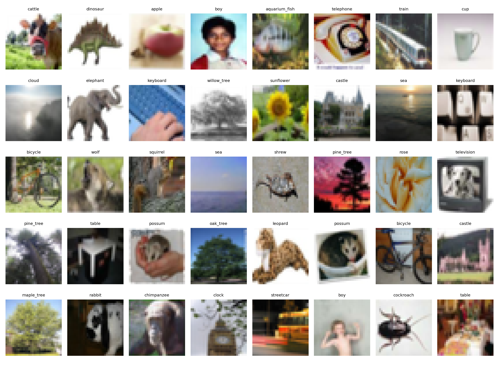
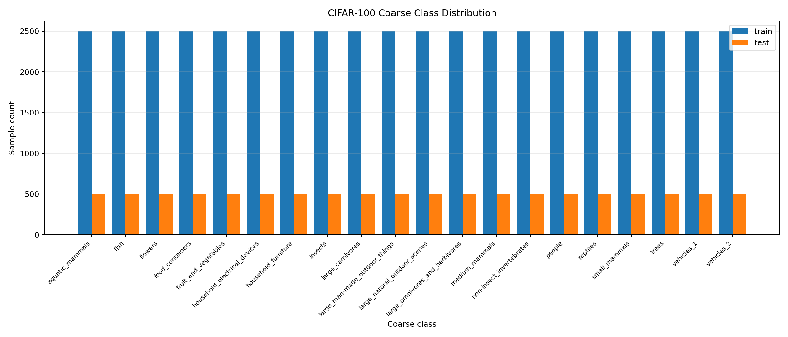

# CIFAR-100 数据探索报告

## 数据位置

- CIFAR-100 目录：`E:\develop\sklearn_model_train\vit_CIFAR-10\data\cifar-100-python`
- 训练文件：`E:\develop\sklearn_model_train\vit_CIFAR-10\data\cifar-100-python\train`
- 测试文件：`E:\develop\sklearn_model_train\vit_CIFAR-10\data\cifar-100-python\test`
- 元信息文件：`E:\develop\sklearn_model_train\vit_CIFAR-10\data\cifar-100-python\meta`

## 基本信息

| 项目 | 数值 |
| --- | ---: |
| 训练集样本数 | 50000 |
| 测试集样本数 | 10000 |
| 总样本数 | 60000 |
| 图像尺寸 | 32 x 32 x 3 |
| 单张图像展开维度 | 3072 |
| 训练数据矩阵形状 | `(50000, 3072)` |
| 测试数据矩阵形状 | `(10000, 3072)` |
| 细分类数量 | 100 |
| 粗分类数量 | 20 |

## 未处理原始数据说明

CIFAR-100 原始数据不是一张张 `.jpg` 或 `.png` 图片，而是保存在 Python 二进制文件中的矩阵。

| 项目 | 数值 |
| --- | --- |
| 原始训练文件 | `train` |
| 原始测试文件 | `test` |
| 原始像素范围 | 0 - 255 |
| 原始存储形状 | `[样本数, 3072]` |
| 还原后的图片尺寸 | `32 x 32 x 3` |
| 通道顺序 | RGB |

用于神经网络训练时，通常会先把像素从 `0 - 255` 缩放到 `0 - 1`，再按 RGB 三通道做标准化。

## CIFAR-100 均值和标准差

下面的统计值来自当前本地 CIFAR-100 原始数据，统计前先执行 `像素值 / 255.0`。

| 数据范围 | RGB 均值 mean | RGB 标准差 std |
| --- | --- | --- |
| 训练集 train | `(0.5071, 0.4866, 0.4409)` | `(0.2673, 0.2564, 0.2762)` |
| 测试集 test | `(0.5088, 0.4874, 0.4419)` | `(0.2683, 0.2574, 0.2771)` |
| 训练集 + 测试集 | `(0.5074, 0.4867, 0.4411)` | `(0.2675, 0.2566, 0.2763)` |

训练代码中建议优先使用训练集统计值做归一化，避免把测试集信息提前泄露到训练流程中。

## 本次特征处理输出

由于当前本机 Python 环境尚未安装 PyTorch，已先使用 NumPy 按同样的核心数值流程完成 CIFAR-100 特征处理，用于验证数据形状、标签编码、归一化和标准化是否正确。

| 输出文件 | 内容 | 形状 |
| --- | --- | --- |
| `outputs/preprocessed_cifar100/train_preprocessed.npz` | 训练集标准化图像、细分类标签、粗分类标签 | images: `(50000, 3, 32, 32)`, labels: `(50000,)` |
| `outputs/preprocessed_cifar100/test_preprocessed.npz` | 测试集标准化图像、细分类标签、粗分类标签 | images: `(10000, 3, 32, 32)`, labels: `(10000,)` |

处理步骤：

1. 将原始矩阵 `[样本数, 3072]` 还原为 `[样本数, 3, 32, 32]`。
2. 执行归一化：像素值从 `[0, 255]` 缩放到 `[0, 1]`。
3. 执行 Z-score 标准化：`(x - mean) / std`。
4. 保留 CIFAR-100 自带的整数标签编码，细分类标签范围为 `0 - 99`。

本次处理校验：

- 训练集输出形状：`(50000, 3, 32, 32)`
- 测试集输出形状：`(10000, 3, 32, 32)`
- 标签范围：`0 - 99`
- 首个训练 batch 形状：`(128, 3, 32, 32)`

## 类别平衡性结论

CIFAR-100 数据集是平衡的。

- 100 个细分类中，每个类别训练集都有 500 张，测试集都有 100 张。
- 20 个粗分类中，每个类别训练集都有 2500 张，测试集都有 500 张。
- 训练集和测试集都覆盖完整的 100 个细分类和 20 个粗分类。

## 可视化图片

### 样本图像网格

### 100 个细分类分布

### 20 个粗分类分布

## 图片格式与噪声观察

- CIFAR-100 的图片是 32 x 32 彩色小图，分辨率较低，细节天然有限。
- 图片以 RGB 三通道存储，每张图片展开后是 3072 个数值。
- 从样本可视化看，图片存在明显低分辨率带来的模糊和压缩感，这是 CIFAR 系列数据集的正常特征。
- 未发现明显文件损坏、全黑图、空图或类别缺失问题。

## 细分类样本数量

| ID | 类别 | 训练集 | 测试集 |
| ---: | --- | ---: | ---: |
| 0 | apple | 500 | 100 |
| 1 | aquarium_fish | 500 | 100 |
| 2 | baby | 500 | 100 |
| 3 | bear | 500 | 100 |
| 4 | beaver | 500 | 100 |
| 5 | bed | 500 | 100 |
| 6 | bee | 500 | 100 |
| 7 | beetle | 500 | 100 |
| 8 | bicycle | 500 | 100 |
| 9 | bottle | 500 | 100 |
| 10 | bowl | 500 | 100 |
| 11 | boy | 500 | 100 |
| 12 | bridge | 500 | 100 |
| 13 | bus | 500 | 100 |
| 14 | butterfly | 500 | 100 |
| 15 | camel | 500 | 100 |
| 16 | can | 500 | 100 |
| 17 | castle | 500 | 100 |
| 18 | caterpillar | 500 | 100 |
| 19 | cattle | 500 | 100 |
| 20 | chair | 500 | 100 |
| 21 | chimpanzee | 500 | 100 |
| 22 | clock | 500 | 100 |
| 23 | cloud | 500 | 100 |
| 24 | cockroach | 500 | 100 |
| 25 | couch | 500 | 100 |
| 26 | crab | 500 | 100 |
| 27 | crocodile | 500 | 100 |
| 28 | cup | 500 | 100 |
| 29 | dinosaur | 500 | 100 |
| 30 | dolphin | 500 | 100 |
| 31 | elephant | 500 | 100 |
| 32 | flatfish | 500 | 100 |
| 33 | forest | 500 | 100 |
| 34 | fox | 500 | 100 |
| 35 | girl | 500 | 100 |
| 36 | hamster | 500 | 100 |
| 37 | house | 500 | 100 |
| 38 | kangaroo | 500 | 100 |
| 39 | keyboard | 500 | 100 |
| 40 | lamp | 500 | 100 |
| 41 | lawn_mower | 500 | 100 |
| 42 | leopard | 500 | 100 |
| 43 | lion | 500 | 100 |
| 44 | lizard | 500 | 100 |
| 45 | lobster | 500 | 100 |
| 46 | man | 500 | 100 |
| 47 | maple_tree | 500 | 100 |
| 48 | motorcycle | 500 | 100 |
| 49 | mountain | 500 | 100 |
| 50 | mouse | 500 | 100 |
| 51 | mushroom | 500 | 100 |
| 52 | oak_tree | 500 | 100 |
| 53 | orange | 500 | 100 |
| 54 | orchid | 500 | 100 |
| 55 | otter | 500 | 100 |
| 56 | palm_tree | 500 | 100 |
| 57 | pear | 500 | 100 |
| 58 | pickup_truck | 500 | 100 |
| 59 | pine_tree | 500 | 100 |
| 60 | plain | 500 | 100 |
| 61 | plate | 500 | 100 |
| 62 | poppy | 500 | 100 |
| 63 | porcupine | 500 | 100 |
| 64 | possum | 500 | 100 |
| 65 | rabbit | 500 | 100 |
| 66 | raccoon | 500 | 100 |
| 67 | ray | 500 | 100 |
| 68 | road | 500 | 100 |
| 69 | rocket | 500 | 100 |
| 70 | rose | 500 | 100 |
| 71 | sea | 500 | 100 |
| 72 | seal | 500 | 100 |
| 73 | shark | 500 | 100 |
| 74 | shrew | 500 | 100 |
| 75 | skunk | 500 | 100 |
| 76 | skyscraper | 500 | 100 |
| 77 | snail | 500 | 100 |
| 78 | snake | 500 | 100 |
| 79 | spider | 500 | 100 |
| 80 | squirrel | 500 | 100 |
| 81 | streetcar | 500 | 100 |
| 82 | sunflower | 500 | 100 |
| 83 | sweet_pepper | 500 | 100 |
| 84 | table | 500 | 100 |
| 85 | tank | 500 | 100 |
| 86 | telephone | 500 | 100 |
| 87 | television | 500 | 100 |
| 88 | tiger | 500 | 100 |
| 89 | tractor | 500 | 100 |
| 90 | train | 500 | 100 |
| 91 | trout | 500 | 100 |
| 92 | tulip | 500 | 100 |
| 93 | turtle | 500 | 100 |
| 94 | wardrobe | 500 | 100 |
| 95 | whale | 500 | 100 |
| 96 | willow_tree | 500 | 100 |
| 97 | wolf | 500 | 100 |
| 98 | woman | 500 | 100 |
| 99 | worm | 500 | 100 |

## 粗分类样本数量

| ID | 类别 | 训练集 | 测试集 |
| ---: | --- | ---: | ---: |
| 0 | aquatic_mammals | 2500 | 500 |
| 1 | fish | 2500 | 500 |
| 2 | flowers | 2500 | 500 |
| 3 | food_containers | 2500 | 500 |
| 4 | fruit_and_vegetables | 2500 | 500 |
| 5 | household_electrical_devices | 2500 | 500 |
| 6 | household_furniture | 2500 | 500 |
| 7 | insects | 2500 | 500 |
| 8 | large_carnivores | 2500 | 500 |
| 9 | large_man-made_outdoor_things | 2500 | 500 |
| 10 | large_natural_outdoor_scenes | 2500 | 500 |
| 11 | large_omnivores_and_herbivores | 2500 | 500 |
| 12 | medium_mammals | 2500 | 500 |
| 13 | non-insect_invertebrates | 2500 | 500 |
| 14 | people | 2500 | 500 |
| 15 | reptiles | 2500 | 500 |
| 16 | small_mammals | 2500 | 500 |
| 17 | trees | 2500 | 500 |
| 18 | vehicles_1 | 2500 | 500 |
| 19 | vehicles_2 | 2500 | 500 |
