# CIFAR-100 模型、数据处理与训练结果说明

本文档说明本项目对比的三个模型：ViT-Tony、ResNet-18、EfficientNetV2-S，并解释数据处理方式、训练结果、准确率曲线和后续改进方向。

## 1. 数据集说明

本项目使用 CIFAR-100 图像分类数据集。

| 项目 | 内容 |
| --- | --- |
| 数据集 | CIFAR-100 |
| 图片数量 | 60,000 张 |
| 训练集 | 50,000 张 |
| 测试集 | 10,000 张 |
| 图片尺寸 | 32 x 32 |
| 通道数 | RGB 3 通道 |
| 细分类别 | 100 类 |
| 粗分类别 | 20 个 superclass |
| 训练集每类数量 | 500 张 |
| 测试集每类数量 | 100 张 |

示例图片：

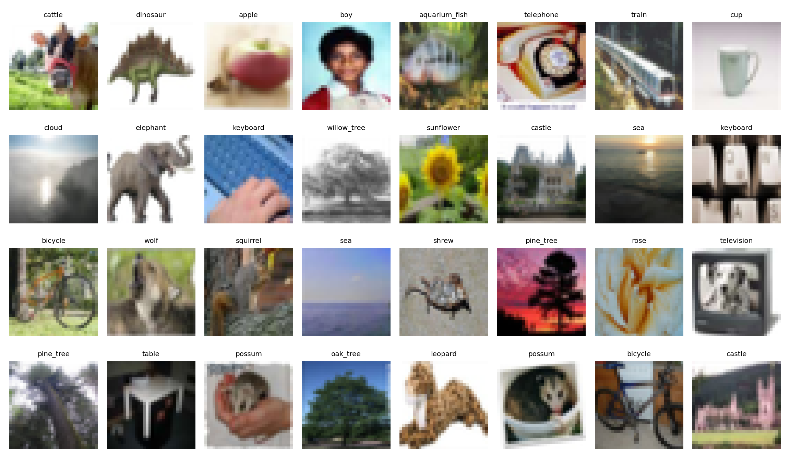

类别分布：

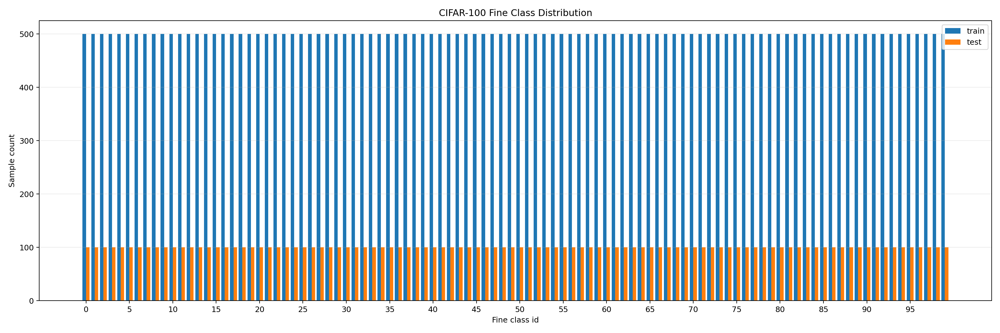


## 2. 本项目做了哪些数据处理

项目里有两条数据处理路线。

### 2.1 预处理 `.npz` 路线

脚本：`preprocess_cifar100_numpy.py`

处理内容：

1. 读取 CIFAR-100 原始 pickle 文件。
2. 将原始 `data` 从 `(N, 3072)` reshape 为 `(N, 3, 32, 32)`。
3. 将像素从 `[0, 255]` 转为 `[0, 1]`。
4. 使用 CIFAR-100 的 RGB 均值和标准差做 Z-score 标准化：

```text
mean = [0.5071, 0.4866, 0.4409]
std  = [0.2673, 0.2564, 0.2762]
```

标准化公式：

```text
x_norm = (x - mean) / std
```

5. 保存细分类标签 `labels`，范围为 `0-99`。
6. 保存粗分类标签 `coarse_labels`。
7. 输出压缩后的 `.npz` 文件：

```text
outputs/preprocessed_cifar100/train_preprocessed.npz
outputs/preprocessed_cifar100/test_preprocessed.npz
```

也就是说，这里的“特征处理”主要是图像张量化、归一化、标准化和标签整理，不是 SIFT、HOG、PCA 这类传统人工特征。

### 2.2 在线增强训练路线

脚本：`train_cifar100_multi_models.py`

训练时使用 `torchvision.datasets.CIFAR100` 自动读取数据，并对训练集做：

```text
RandomCrop(32, padding=4)
RandomHorizontalFlip()
ToTensor()
Normalize(mean=[0.5071, 0.4867, 0.4408], std=[0.2675, 0.2565, 0.2761])
```

测试集只做：

```text
ToTensor()
Normalize(...)
```

脚本还支持可选增强：

- `--randaugment`
- `--mixup_alpha`
- `--cutmix_alpha`
- `--label_smoothing`

本次记录的 50 epoch 对比训练使用的是基础增强和标准化，没有开启 MixUp/CutMix/RandAugment。

## 3. ViT-Tony

### 3.1 基本信息

| 项目 | 内容 |
| --- | --- |
| 类型 | Vision Transformer 轻量模型 |
| 输入 | 32 x 32 RGB 图片 |
| Patch size | 4 |
| Patch 数量 | 64 |
| Embedding dim | 192 |
| Transformer depth | 6 |
| Attention heads | 6 |
| 分类数 | 100 |

### 3.2 架构特点

ViT-Tony 将图片切成 patch，每个 patch 当作一个 token。流程是：

```text
32x32 image
-> 4x4 patches
-> patch embedding
-> add CLS token and position embedding
-> Transformer Encoder
-> classification head
-> 100-class output
```

### 3.3 优点

- 可以通过 self-attention 直接建模全局关系。
- 对图像整体结构和远距离区域关系更敏感。
- 注意力机制有一定可解释性，可以进一步做 attention 可视化。

### 3.4 缺点

- 从零训练时更依赖大数据和强数据增强。
- CIFAR-100 只有 50,000 张训练图片，对 Transformer 偏小。
- 32 x 32 图片很小，切成 4 x 4 patch 后每个 token 信息有限。
- 没有 ImageNet 预训练时，准确率通常不如强 CNN 稳定。

## 4. ResNet-18

### 4.1 基本信息

| 项目 | 内容 |
| --- | --- |
| 类型 | CNN 卷积神经网络 |
| 层数 | 18 层 |
| 核心结构 | Residual Block |
| 分类数 | 100 |

### 4.2 架构特点

ResNet-18 使用卷积层提取局部特征，并通过残差连接缓解深层网络训练困难：

```text
x -> Conv/BN/ReLU -> Conv/BN -> + x -> ReLU
```

本项目中为了适配 CIFAR-100 的 32 x 32 小图，修改了 ResNet-18：

- 第一层卷积改为 `3x3, stride=1, padding=1`。
- 去掉原始 ImageNet 版的 `maxpool`。

这样可以避免一开始就把 32 x 32 图片下采样得太厉害。

### 4.3 优点

- 对小图像、小数据集更稳定。
- CNN 的局部归纳偏置适合学习边缘、纹理、形状等图像特征。
- 残差连接让训练更容易收敛。
- 在本次实验中表现最好。

### 4.4 缺点

- 全局关系需要靠多层卷积间接建模。
- 对长距离依赖的表达不如 Transformer 直接。

## 5. EfficientNetV2-S

### 5.1 基本信息

| 项目 | 内容 |
| --- | --- |
| 类型 | 高效 CNN |
| 核心模块 | Fused-MBConv / MBConv / SE |
| 特点 | 深度、宽度、分辨率综合缩放 |
| 分类数 | 100 |

### 5.2 架构特点

EfficientNetV2-S 使用更复杂的高效卷积结构：

- Fused-MBConv：训练速度更友好的融合卷积模块。
- MBConv：移动端常用的 inverted bottleneck 卷积。
- Squeeze-and-Excitation：自动学习通道重要性。
- BatchNorm：稳定中间特征分布。

本项目中为了适配 32 x 32 图片，将 EfficientNetV2-S 的第一层 stride 改为 `1`，减少过早下采样。

### 5.3 优点

- 参数和计算设计更高效。
- 在大数据和预训练场景下通常性能很强。
- 配合强增强、合适学习率、预训练权重时潜力较高。

### 5.4 缺点

- 结构比 ResNet-18 更复杂，训练更慢。
- 从零训练时对学习率、batch size、增强策略更敏感。
- 原本更常用于较大分辨率图片，直接迁移到 32 x 32 需要适配。

## 6. 三个模型对比

| 特性 | ViT-Tony | ResNet-18 | EfficientNetV2-S |
| --- | --- | --- | --- |
| 架构类型 | Transformer | CNN | 高效 CNN |
| 主要特征提取方式 | Patch + self-attention | 卷积 + 残差连接 | Fused-MBConv / MBConv |
| 全局建模 | 直接 | 间接 | 间接 |
| 小数据集稳定性 | 一般 | 强 | 中等 |
| 训练难度 | 中等偏高 | 低 | 中等偏高 |
| 训练速度 | 中等 | 快 | 慢 |
| 适合数据 | 大数据、可预训练、结构关系明显 | 小图像、小中型数据集 | 大数据、强增强、预训练 |
| 本次表现 | 中等 | 最好 | 中等偏低 |

## 7. 训练结果

本次训练 50 epoch，结果如下：

| 模型 | 最佳 Epoch | 最佳测试准确率 | 最终训练准确率 | 最终测试准确率 |
| --- | ---: | ---: | ---: | ---: |
| ViT-Tony | 45 | 58.18% | 77.58% | 58.05% |
| ResNet-18 | 47 | 76.33% | 99.86% | 76.23% |
| EfficientNetV2-S | 49 | 55.57% | 60.27% | 55.48% |

最佳准确率柱状图：

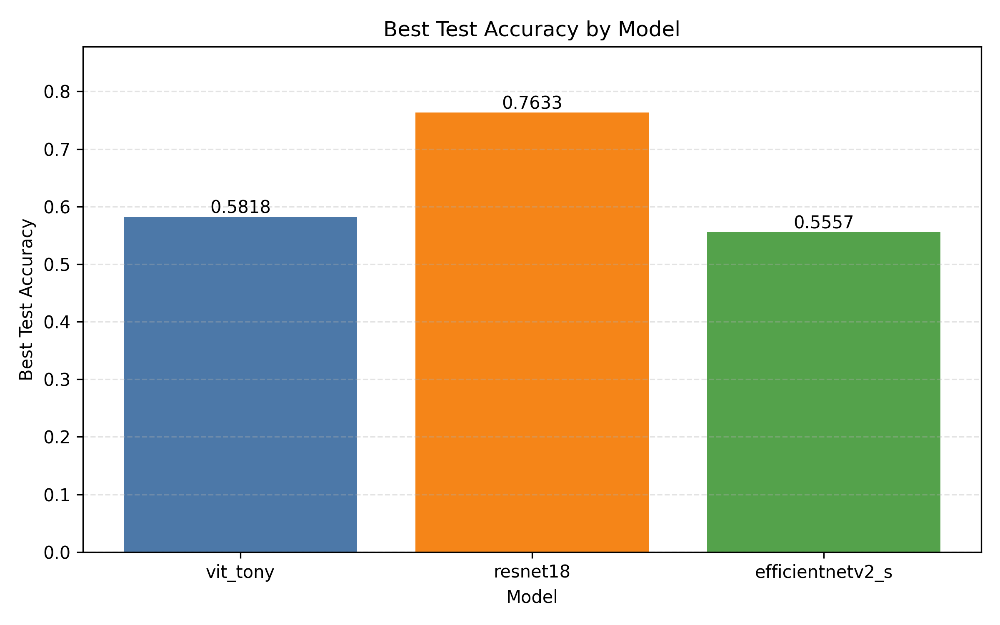

测试准确率对比曲线：

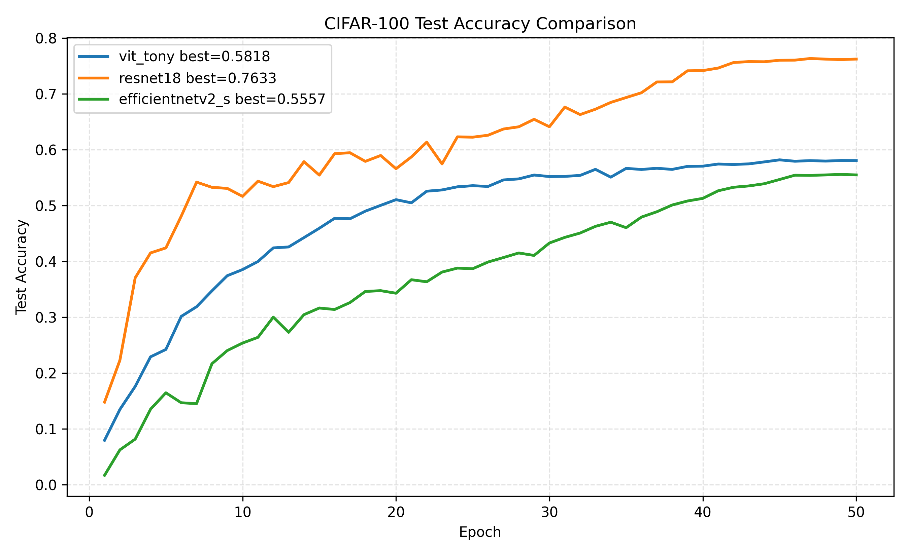

测试 loss 对比曲线：

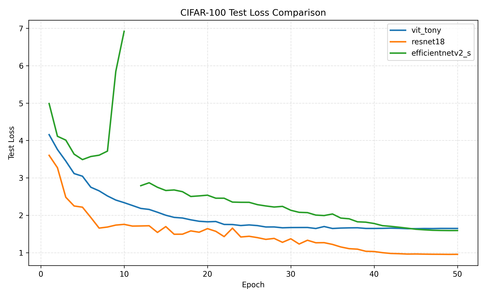

## 8. 单模型训练曲线

ViT-Tony accuracy：

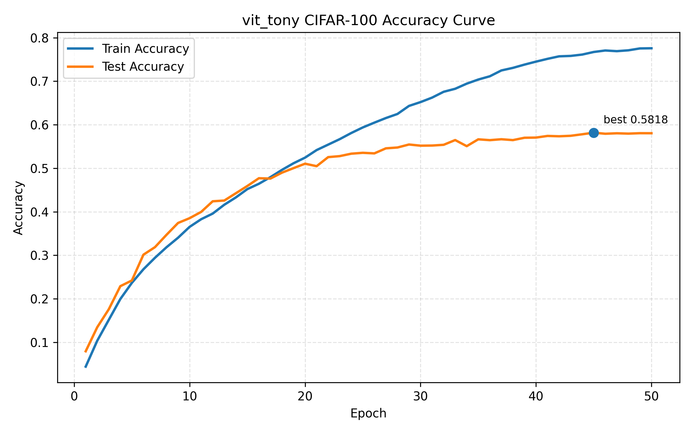

ViT-Tony loss：

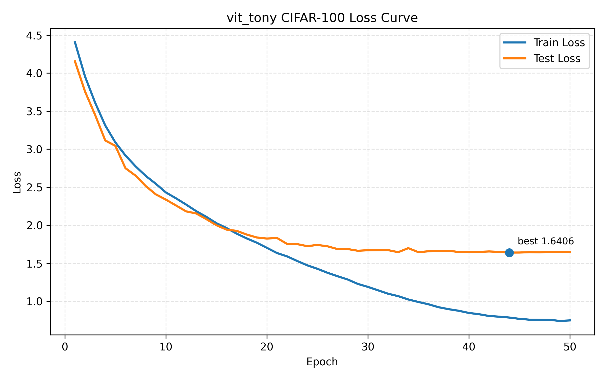

ResNet-18 accuracy：

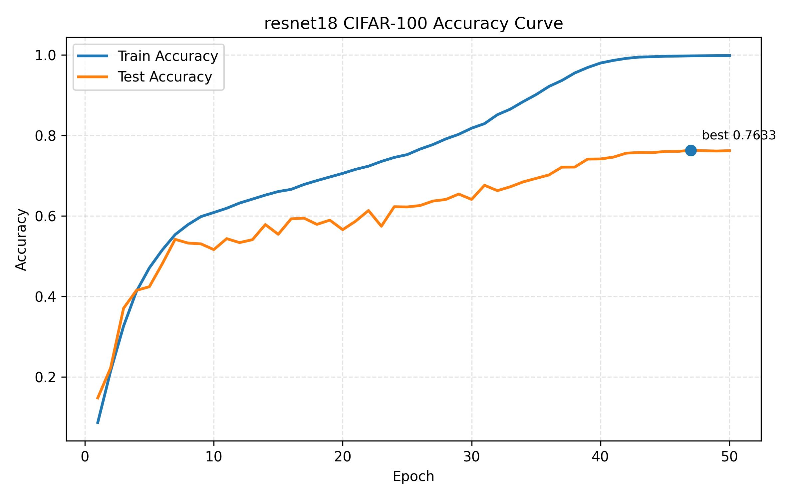

ResNet-18 loss：

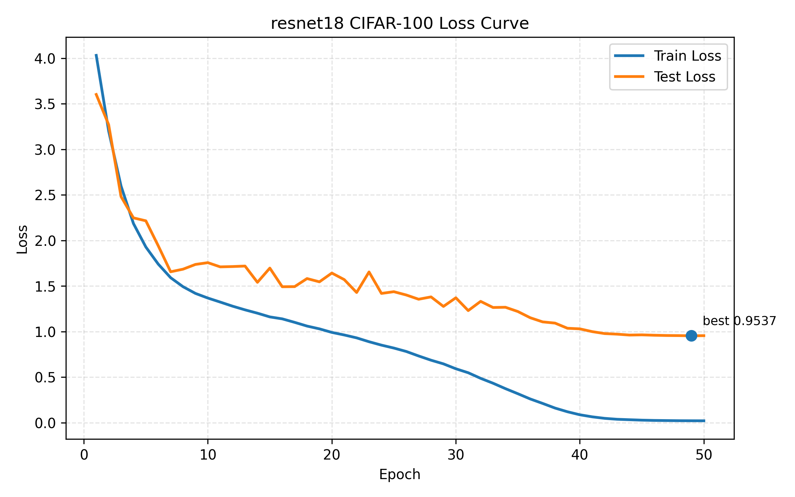

EfficientNetV2-S accuracy：

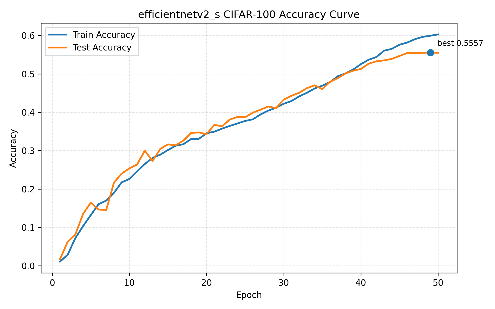

EfficientNetV2-S loss：

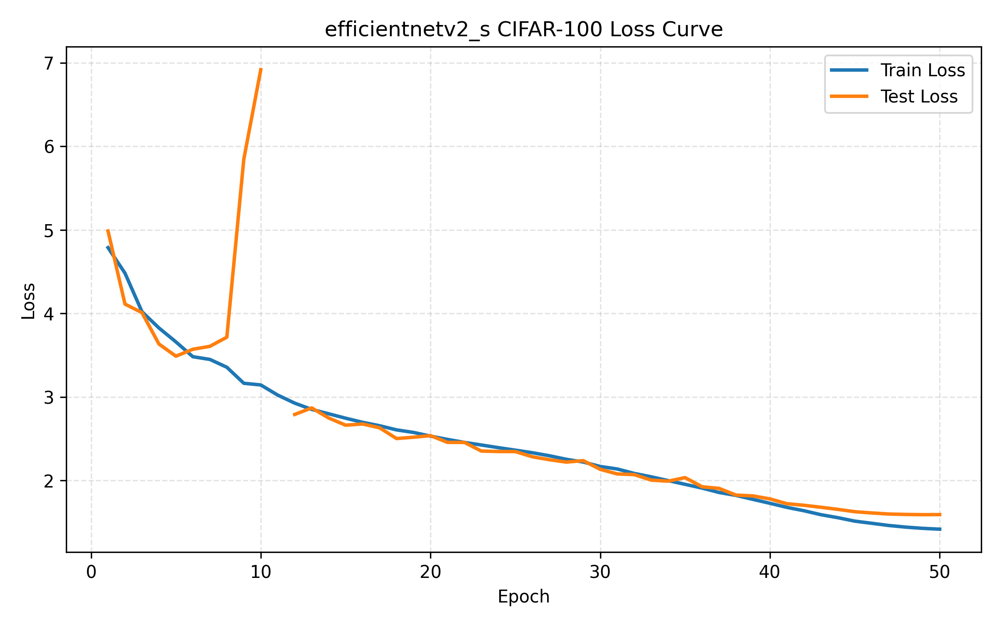

## 9. 为什么 ViT-Tony 只有 50% 多准确率

ViT-Tony 的最佳测试准确率为 58.18%。这不代表模型不能用，而是说明当前配置下它是一个从零训练的小型 ViT baseline。

主要原因：

1. CIFAR-100 类别多。100 类随机猜只有 1%，任务本身比 CIFAR-10 难很多。
2. 训练集规模偏小。ViT 通常更依赖大规模数据或预训练权重。
3. 图片分辨率低。32 x 32 图片切成 4 x 4 patch 后只有 64 个 token，每个 token 信息很少。
4. ViT 缺少 CNN 的局部归纳偏置。CNN 天生擅长边缘、纹理和局部形状，小数据集上更占优势。
5. 当前增强策略较基础。没有启用 RandAugment、MixUp、CutMix、RandomErasing 等更强策略。
6. 当前训练轮数为 50 epoch，对从零训练 ViT 可能还不够。

从训练结果看，ViT-Tony 最终训练准确率 77.58%，测试准确率 58.05%，存在一定过拟合：训练集学得更好，但泛化到测试集下降明显。

## 10. 为什么训练最开始准确率很低

CIFAR-100 有 100 个类别，随机猜测准确率是：

```text
1 / 100 = 1%
```

所以第一轮准确率低是正常现象，尤其是从零初始化模型。

本次前三个模型前 5 个 epoch 的测试准确率大致是：

| Epoch | ViT-Tony | ResNet-18 | EfficientNetV2-S |
| ---: | ---: | ---: | ---: |
| 1 | 7.94% | 14.78% | 1.67% |
| 2 | 13.47% | 22.27% | 6.23% |
| 3 | 17.60% | 37.06% | 8.16% |
| 4 | 22.90% | 41.51% | 13.52% |
| 5 | 24.22% | 42.41% | 16.46% |

EfficientNetV2-S 第一轮只有 1.67%，接近随机猜，但后续持续上升，因此不是数据错位或模型完全失效，而是初期热身慢。

原因包括：

- 模型从零随机初始化。
- CIFAR-100 类别多，初期分类难。
- EfficientNetV2-S 结构复杂，BatchNorm 统计量前几轮不稳定。
- 学习率 warmup 阶段还没有充分学习。
- 小图像输入对大模型不友好。

如果一个模型连续很多轮卡在 1%-3%，才需要重点检查标签错位、学习率、标准化、`num_classes` 和 optimizer step。

## 11. 数据处理和训练改进建议

### 11.1 对 ViT-Tony 的改进

- 增加训练轮数，例如 100-200 epoch。
- 开启 `--randaugment`。
- 尝试 MixUp/CutMix：

```powershell
python train_cifar100_multi_models.py --model_name vit_tony --epochs 100 --batch_size 128 --vit_lr 0.0003 --randaugment --mixup_alpha 0.2 --cutmix_alpha 1.0 --label_smoothing 0.1
```

- 尝试更小 patch，例如 patch size 2，让模型保留更多局部细节。
- 使用 ImageNet 预训练 ViT 再 fine-tune。
- 增强正则化，例如 dropout、stochastic depth、weight decay。

### 11.2 对 ResNet-18 的改进

- 使用 CosineAnnealing + 更长训练。
- 加入 CutMix/MixUp 提升泛化。
- 降低过拟合：ResNet-18 最终训练准确率接近 100%，测试准确率 76%，说明还能通过增强和正则化提高泛化。

### 11.3 对 EfficientNetV2-S 的改进

- 使用更小学习率，例如 SGD `lr=0.01` 或 AdamW `lr=0.001`。
- 使用 ImageNet 预训练权重。
- 训练更久，例如 100 epoch。
- 确保第一层 stride 适配 32 x 32 小图。
- 使用更稳定的 batch size，例如 128，显存允许可更大。

### 11.4 对数据处理的改进

- 保持训练集和测试集使用同一套 mean/std。
- 增加更强数据增强：RandAugment、RandomErasing、AutoAugment。
- 使用 MixUp/CutMix 让模型更抗过拟合。
- 检查增强后图片是否仍然可辨认。
- 可以尝试把 CIFAR-100 resize 到更大尺寸，如 64 x 64 或 224 x 224，再配合预训练模型 fine-tune。

## 12. 总结

本次实验结论：

1. ResNet-18 在当前 CIFAR-100 设置下表现最好，最佳测试准确率 76.33%。
2. ViT-Tony 是一个有效 baseline，但从零训练在小数据集上不如 ResNet 稳定。
3. EfficientNetV2-S 初期很慢，但准确率持续上升；当前结果不理想主要与从零训练、32 x 32 输入和超参数有关。
4. 后续最值得尝试的是预训练权重、更强数据增强、更长训练和更细致的学习率调参。
